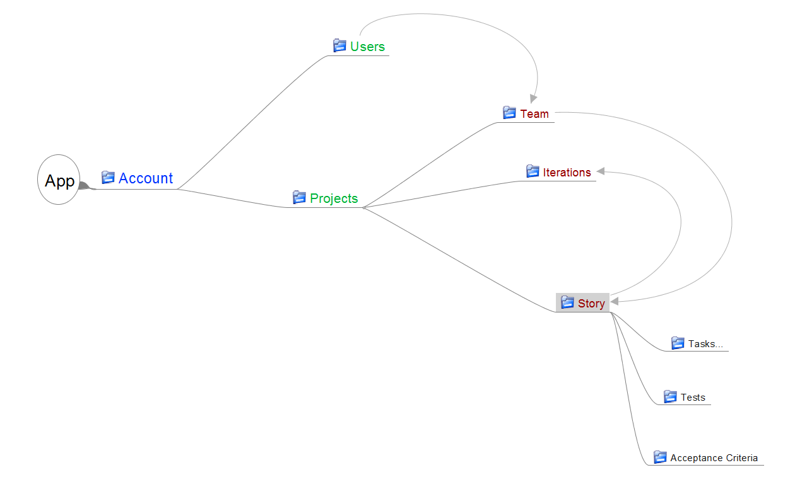

-----
 
##ClearPath Agile

###Object Model

**Account**

- ID
- Account Admin (User.ID)
- Plan (free, small, medium, large)
- Story Types (list of `story type`)
- Task Types (list of `task type`)
- Enable Iterations
- Enable Acceptance Criteria
- Enable Tests
- Enable Time Tracking
    - Days 
        - Hours per day
    - Hours
- Agile Estimation
    - Shirt Size (x-small,small,medium,large,x-large)
    - Coffee Cup (small,tall,medium,grande,venti)
    - Fibonaccia Numbers (½,1,2,3,5,8,13)
    - Points (1...~)

**User**

- ID
- First Name
- Last Name
- Password
- Email
- Gravatar (or image upload)

**Project**

- ID
- Project Name
- Email (to allow email create for story(s))
- Notifications (type of events to notify team)

**Iteration**

- ID
- Name
- Start Date
- End Date

**Story**

- ID
- Title
- Type
- Owner (`user.id`)
- Agile Estimation
- Orig Time Estimate
- Tags
- Description
- State (`state list item`)
- Iteration (`iteration.id`)
- Blocked 
- Time Spent
- Time Left

**Task**

- Name
- Owner (`user.id`)
- State (`state list item`)
- Blocked
- Orig Time Estimate
- Time Spent
- Time Left 

**Team**
- List of `user.id` assigned to a project 

**Story Type**

- Name
- Icon
- Color
- Dflt Story (y/n)

**Task Type**

- Name
- Icon
- Color
- Dflt Task (y/n)

**Test**

- Test Name
- Test steps
- Test Priority
- Test Tags

**Acceptance Criteria**

- (text block to describe criteria)

**State List**

- Todo
- In Progress
- Done

